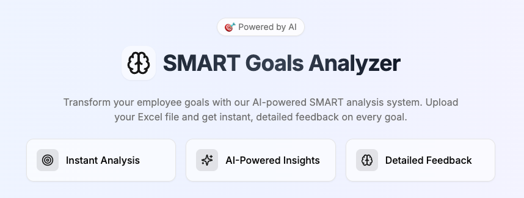

# SMART Goals Analyzer

An AI-powered web application that analyzes employee goals based on SMART criteria (Specific, Measurable, Achievable, Relevant, Time-bound) and provides detailed feedback and scoring.



## Overview

SMART Goals Analyzer helps organizations evaluate and improve their employee goals by:
- Analyzing goals against SMART criteria
- Providing instant feedback and scoring
- Generating improvement suggestions
- Calculating employee performance metrics

## Features

- 📊 **Instant Analysis**: Upload Excel files and get immediate SMART evaluation
- 🤖 **AI-Powered**: Leverages OpenAI's GPT-3.5 for intelligent goal analysis
- 📈 **Detailed Scoring**: Individual goal scores and employee averages
- 💡 **Smart Suggestions**: Actionable feedback for goal improvement
- 📱 **Responsive Design**: Works seamlessly on all devices
- 🔄 **Batch Processing**: Handles multiple goals efficiently

## Tech Stack

- **Frontend**: Next.js 14 (App Router)
- **Styling**: Tailwind CSS
- **Components**: shadcn/ui
- **AI**: OpenAI GPT-3.5
- **Data Processing**: XLSX
- **Notifications**: Sonner Toast


## Getting Started

### Prerequisites

- Node.js 18+
- npm or yarn
- OpenAI API key

### Installation

1. Clone the repository

```bash
git clone https://github.com/prasanthLalapeta/smart-goals-analyzer.git
```

2. Install dependencies

```bash
npm install
```


3. Set up environment variables:

Create a `.env.local` file:

```bash
OPENAI_API_KEY=your_openai_api_key_here
```

4. Start the development server

```bash
npm run dev
```

## Usage Guide

### Excel Template Format

Required columns in your Excel file:

| Column | Description |
|--------|-------------|
| Employee Person ID | Unique identifier for each employee |
| Employee Display Name | Full name of the employee |
| Job | Employee's job role or title |
| Goal Name | Brief title of the goal |
| Deliverable | What needs to be achieved |
| Target Result | Expected outcome with metrics |

### Analysis Process

1. Download the Excel template
2. Fill in your employee goals data
3. Upload the completed file
4. Review the AI-generated analysis:
   - Individual goal scores
   - SMART criteria evaluation
   - Improvement suggestions
   - Employee performance summary
5. Export results if needed

## Key Components

### File Upload
- Drag-and-drop interface
- File type validation
- Progress indication
- Error handling

### Results Display
- Tabbed interface for goals and employees
- Sortable tables
- Color-coded scoring
- Downloadable results

### Help Section
- SMART criteria guide
- Example evaluations
- Template instructions
- Best practices

## Contributing

Contributions are welcome! Please feel free to submit a Pull Request.

## License

This project is licensed under the MIT License

## Acknowledgments

- Built with [Next.js](https://nextjs.org/)
- UI components from [shadcn/ui](https://ui.shadcn.com/)
- AI powered by [OpenAI](https://openai.com/)
